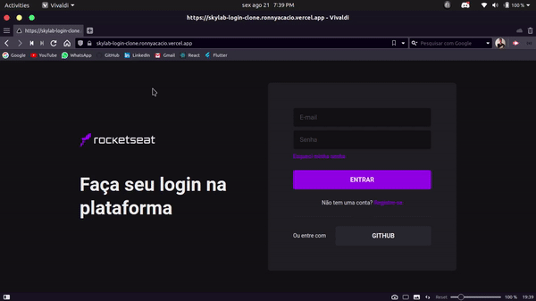

<h1 align="center">
  
</h1>

  

  

  

  

  

  

 

## 💻 Projeto

<<<<<<< HEAD
Esse projeto foi feito para treinar a minha habilidade de criação de UI's com ReactJS. Além disso, visando a simplificação e produtividade fiz uso de Next JS em conjunto com o desing system Chakra UI, foi escolhido o skylab-login por conta da sua simples e bonita interface! Sendo assim seria muito produtivo realizar esse clone! Acesse aqui [Skylab-login-clone](https://skylab-login-clone.ronnyacacio.vercel.app)
=======
Esse projeto foi feito para treinar a minha habilidade de criação de UI's com ReactJS. Além disso, visando a simplificação e produtividade fiz uso de Next JS em conjunto com o desing system Chakra UI, foi escolhido o skylab-login por conta da sua simples e bonita interface! Sendo assim seria muito produtivo realizar esse clone! Acesse aqui [Skylab-login-clone](https://skylab-login-clone-gamma.vercel.app)
>>>>>>> 761cb97be21341888b488f73e87d28dd4b660d80

 

## 🌐 Preview

<h1 align="center">
    
</h1>

## 🚀 Tecnologias

Esse projeto foi desenvolvido com as seguintes tecnologias:

- [React](https://reactjs.org)
- [Typescript](https://www.typescriptlang.org/)
- [NextJS](https://styled-components.com/)
- [Chakra UI](https://chakra-ui.com)
- [Emotion-theming](https://emotion.sh/docs/theming)

 

## 🔨 Deploy WEB: Vercel

 

  Made with 💜 by <a href="https://www.linkedin.com/in/ronnyacacio/"> Ronny Acácio </a>

